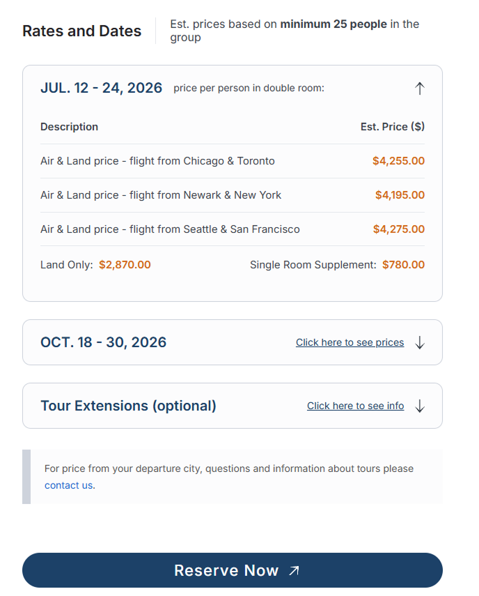

# Ecom Dynamic Tables

ACF-driven shortcodes for rendering dynamic, collapsible pricing
tables (with an optional extensions accordion) on any WordPress site.

**Module version:** `2.0.0`

> **Upgrading from 1.x?** This is a breaking release. See
> [Upgrading to 2.0](#upgrading-to-20) at the bottom.



---

## Install

This module is distributed as a standalone Git repo — the folder
**is** the repo. Pick one install path:

### Option A — Git clone (recommended, gives you updates)

From your theme folder:

```powershell
cd wp-content/themes/<your-theme>
git clone https://github.com/josipmestrovic/ecom-dynamic-tables.git dynamic-tables
```

### Option B — Manual copy (no version link)

Download the repo as a ZIP from GitHub and unzip it as
`wp-content/themes/<your-theme>/dynamic-tables/`. You won't be able to
`git pull` future updates — you'd have to re-download.

### Activation (both options)

Add this single line to your child theme's `functions.php`:

```php
require_once get_stylesheet_directory() . '/dynamic-tables/dynamic-tables.php';
```

The module is a thin bootstrap — it just `require_once`s every file in
`includes/`. The shared CSS **and** the accordion JS are registered
globally but only enqueued when a shortcode actually renders, so pages
that don't use a shortcode incur zero asset cost.

---

## Working with this component

The folder you just cloned has its own `.git` directory — it's a normal
git repo that happens to live inside a WordPress theme. Edit files
normally; sync with plain git commands.

### Pull updates from GitHub

```powershell
cd wp-content/themes/<your-theme>/dynamic-tables
git pull
```

Hard-refresh the browser. Asset cache-busting is automatic via
`filemtime()`.

### Push local improvements upstream

```powershell
cd wp-content/themes/<your-theme>/dynamic-tables
git status
git add .
git commit -m "Fix chevron alignment on mobile"
git push
```

### Releasing a new version

1. Bump version in **two places**:
   - `dynamic-tables.php` → `ECOM_DT_VERSION` constant.
   - `README.md` → "Module version" line at top + new Changelog entry.
2. Commit + tag + push:
   ```powershell
   git add .
   git commit -m "Release 2.1.0: <one-line summary>"
   git tag v2.1.0
   git push
   git push --tags
   ```

Other sites opt-in with their next `git pull`. To pin a site to an
exact version: `git checkout v2.1.0`.

### Semver

| Change | Bump |
| --- | --- |
| Bug fix, no behavior change | patch (`2.0.0` → `2.0.1`) |
| New feature, backward compatible | minor (`2.0.0` → `2.1.0`) |
| Breaking change (removed shortcode arg, renamed CSS class consumers depend on, ACF field rename) | major (`2.0.0` → `3.0.0`) |

### Nested `.git` warning?

If the parent theme is *also* a git repo, git will warn about the
nested `.git` inside `dynamic-tables/`. Add `dynamic-tables/` to the
parent's `.gitignore` — the component still works, it's just versioned
separately (which is the goal).

---

## File structure

```
dynamic-tables/
├── README.md                  ← you are here
├── dynamic-tables.php         ← thin bootstrap + constants
├── dynamic-tables.css         ← shared shortcode styles
├── dynamic-tables.js          ← accordion controller (vanilla, no deps)
└── includes/
    ├── assets.php             ← wp_register_style + wp_register_script
    ├── helpers.php            ← ecom_dt_format_price() + ecom_dt_render_wysiwyg() + filters
    └── shortcode-pricing.php  ← [ecom_dynamic_table]
```

**Adding a new shortcode** is a 2-step drop-in:

1. Create `includes/shortcode-{name}.php` containing a render function +
   `add_shortcode()` call.
2. `require_once` it from `dynamic-tables.php`.

No other file needs to change.

---

## Constants

Defined by the bootstrap (`dynamic-tables.php`) with `defined()` guards
so they're safe to override from `wp-config.php` if ever needed:

| Constant | Default | Purpose |
| --- | --- | --- |
| `ECOM_DT_DIR` | `__DIR__` | Absolute filesystem path to the module root. Used by `includes/*.php` to resolve sibling files. |
| `ECOM_DT_VERSION` | `'2.0.0'` | Module version. Available for cache-busting / debugging. (Per-asset cache-busting uses `filemtime()` — see below.) |

---

## Asset loading strategy

- **Register** on `wp_enqueue_scripts`, **enqueue** inside the shortcode
  callback. `ecom_dynamic_tables_enqueue_assets()` calls `wp_register_*`
  for both `ecom-dynamic-tables-css` and `ecom-dynamic-tables-js`; the
  actual `wp_enqueue_*` calls live inside
  `ecom_dt_render_dynamic_table()`. Pages without a shortcode never pull
  either asset.
- **Cache-busting via `filemtime()`** — every deploy bumps the version
  string automatically; no manual version juggling.
- **JS loads in the footer**, with no dependencies (no jQuery).
- **No admin-side enqueue** — the module is front-end only.

---

## Shortcodes

### `[ecom_dynamic_table]`

Renders pricing for the current post as an **accordion of rows**,
optionally followed by a single **Extensions** accordion and a
disclaimer footer. The first row renders open by default; the rest
start collapsed and expand on click / Enter / Space.

Reads the following ACF fields on the current post. The field names
below are the **default schema** the shortcode expects — mirror these
in your own ACF field group:

| ACF field | Type | Required | Use |
| --- | --- | --- | --- |
| `tour_pricing_note` | Text | No | Note shown right of the "Rates and Dates" heading. |
| `tour_departures` | Repeater | Yes (or no output) | One accordion block per row. |
| └ `departure_label` | Text | Yes | Label / heading shown left of the toggle row (e.g. "July 12 - 24, 2026"). |
| └ `departure_note` | Text | No | Caption shown right of the label — **only visible when the row is open** (e.g. "Est. price per person in double room:"). |
| └ `prices` | Sub-repeater | No | Description + amount rows. |
| &nbsp;&nbsp;&nbsp; └ `price_description` | Text | Yes | Row label. |
| &nbsp;&nbsp;&nbsp; └ `price_amount` | Number | Yes | Numeric value. Formatted via `ecom_dt_format_price`. |
| └ `land_only_price` | Number | No | "Land Only" line under the table. |
| └ `single_room_supplement` | Number | No | Supplement line under the table. |
| `pricing_footer` | Textarea | No | Disclaimer block. Sanitized with `wp_kses_post`. |
| `tour_extensions_boolean` | True/False | No | Master switch for the optional **Extensions** accordion below the pricing block. |
| `tour_extension_info` | WYSIWYG | When extensions on | First section inside the extensions accordion body. Sanitized with `wp_kses_post`. |
| `tour_extension_itinerary` | WYSIWYG | When extensions on | Second section inside the extensions accordion body. Sanitized with `wp_kses_post`. |

> **Why are some field names still prefixed `tour_` / `departure_`?**
> They're the historical schema this module was extracted from and they
> are kept verbatim so existing installs upgrading from 1.x don't have
> to migrate ACF data. Treat them as opaque field keys — they have no
> semantic meaning to the renderer.

Bails silently outside `is_singular()` (returns an empty string on
archives / search / 404 / multi-post listings).

The **Extensions** block renders only when `tour_extensions_boolean` is
`true` **AND** at least one of the two WYSIWYG fields has content
(defensive guard — avoids an empty toggle). It uses the same
`.ecom-row-block` / `.ecom-row-toggle` / `.ecom-row-body` classes as
the pricing accordion, so it inherits all visual styling and the
accordion JS automatically. It ships collapsed by default with a
"Click here to see info" CTA.

#### Behavior

- **First row open, rest collapsed** — handled in PHP (`.is-collapsed`
  shipped on the body element from the renderer) so there's no flash of
  expanded content.
- **Toggle row** is a real `<button class="ecom-row-toggle">` with
  `aria-expanded` / `aria-controls` — keyboard activation is native.
  When collapsed it shows the label + a "Click here to see prices" CTA;
  when expanded it shows the label + `departure_note` caption (if any).
  The chevron stays anchored to the right edge in both states and
  rotates 180° when open.
- **Animation** — `dynamic-tables.js` measures `scrollHeight` and
  animates `max-height` + `opacity` on `.ecom-row-body`. The collapsed
  state is driven by a `.is-collapsed` class (not the native `hidden`
  attribute) so transitions stay smooth.
- **Print** — all rows render fully expanded; chevron + CTA hidden.
- **Reduced motion** — `prefers-reduced-motion: reduce` skips the
  height / opacity transitions.

---

## Accessibility

- Toggle is a **real `<button type="button">`** — Enter / Space and
  focus order come for free, no JS keyboard handlers needed.
- `aria-expanded` and `aria-controls` are kept in sync by the JS
  controller; ID pairing uses `wp_unique_id( 'ecom-row-' )` so multiple
  shortcode instances on one page don't collide.
- Visible focus ring: 2px solid `#1C4168`, inset.
- Chevron is `aria-hidden="true"` (decorative).
- Print + reduced-motion media queries are honored (see Behavior).

---

## Public PHP surface

| Function | File | Purpose |
| --- | --- | --- |
| `ecom_dynamic_tables_enqueue_assets()` | `includes/assets.php` | Hooked to `wp_enqueue_scripts`. Registers the shared stylesheet **and** the accordion script (does not enqueue — shortcodes pull them on render). |
| `ecom_dt_format_price( $amount )` | `includes/helpers.php` | Returns a localized currency string (`$1,250.00`-style). |
| `ecom_dt_render_wysiwyg( $value )` | `includes/helpers.php` | Runs a WYSIWYG value through `the_content` with `wptexturize` **disabled** for that single call, then restores it. Provided to avoid no-glyph "tofu" boxes when the rendering font lacks U+2018 / U+2019 / U+201C / U+201D / U+2013 / U+2014 / U+2026 — see Limitations. |
| `ecom_dt_render_dynamic_table()` | `includes/shortcode-pricing.php` | `[ecom_dynamic_table]` callback. |

## Filters

| Filter | Args | Purpose |
| --- | --- | --- |
| `ecom_dt_currency_symbol` | `$symbol` | Change `$` to `€`, `£`, etc. |
| `ecom_dt_format_price` | `$rendered, $amount, $symbol` | Override the entire price string (e.g. for symbol-after-amount locales). |

---

## JavaScript module

`dynamic-tables.js` — vanilla, IIFE-scoped, zero dependencies.

- **Single delegated `click` listener on `document`** — handles every
  current and future `.ecom-row-toggle` without rebinding when the DOM
  changes.
- `TRANSITION_MS = 220` matches the CSS `transition-duration` on
  `.ecom-row-body`.
- **Expand**: measures `scrollHeight`, sets `max-height: 0` →
  `requestAnimationFrame` → animates to the measured pixel height,
  then clears the inline `max-height` after the transition so the body
  can grow freely if its content changes later (responsive WYSIWYG
  images, etc.).
- **Collapse**: locks the current height inline → forces a reflow →
  re-applies `.is-collapsed` and `max-height: 0` to animate back down.
- Toggles `aria-expanded` on the button and `.is-open` on the parent
  `.ecom-row-block` so CSS hooks (chevron rotation, caption / CTA
  visibility) stay in sync.

---

## Styling tokens

Re-use these across any future shortcode so the visual language stays
consistent. Defined in `dynamic-tables.css`:

| Token | Value | Where |
| --- | --- | --- |
| Surface | `#FCFCFD` | Block background, table cells. |
| Border | `#CED3DC` | Block outline (1px, 12px radius). |
| Divider | `#CED3DC80` | Table row borders, extras separator. |
| Label / heading | `#1C4168` | `.ecom-row-label`, focus ring, CTA link. |
| Body / table strings | `#384049` | Cells, captions, extras labels. |
| Price | `#D36815` | Price column values, Land Only / Single Supplement amounts. |
| Radius | `12px` | `.ecom-row-block`. |
| Label typography | Inter 600 / 20px | `.ecom-row-label`. Falls back to `system-ui, sans-serif` if Inter isn't loaded by the parent theme. |

The optional CSS custom property `--ecom-font-body` is read by
`.ecom-pricing-title` and `.ecom-pricing-note` if defined — set it on
`:root` (or any ancestor) in your theme to override the body font for
the heading row.

**Bold rules inside the table:**

- Column titles (`Description`, `Est. Price ($)`) — semibold, `#384049`.
- Price values — semibold, `#D36815`.
- Everything else (descriptions, extras labels) — regular weight.

---

## CSS class reference

All classes are prefixed `ecom-` (with `is-collapsed` / `is-open` as
the only state classes). If you write custom CSS in your child theme,
target these:

| Class | Element |
| --- | --- |
| `.ecom-pricing-section` | Outer wrapper. |
| `.ecom-pricing-header` | Header row (heading + note). |
| `.ecom-pricing-title` | "Rates and Dates" heading. |
| `.ecom-pricing-note` | Pricing-note slot in header row. |
| `.ecom-pricing-footer` | Footer disclaimer block. |
| `.ecom-rows` | Wrapper around the row blocks. |
| `.ecom-row-block` | One accordion item (also used by extensions). |
| `.ecom-row-toggle` | The `<button>` header. |
| `.ecom-row-label` | Label text inside the toggle. |
| `.ecom-row-toggle-caption` | Caption shown when row is OPEN. |
| `.ecom-row-toggle-cta` | CTA shown when row is COLLAPSED. |
| `.ecom-row-chevron` | Chevron SVG wrapper. |
| `.ecom-row-body` | Expandable body. |
| `.ecom-prices-table` | Inner pricing table. |
| `.ecom-extras` | Land-only / supplement footer. |
| `.ecom-extras-land-only` / `.ecom-extras-single-supplement` | Individual extras lines. |
| `.ecom-extras-price` | Bold price value inside extras. |
| `.ecom-extensions-section` | Wrapper for the optional extensions accordion. |
| `.ecom-extensions-body` | Body of the extensions accordion. |
| `.ecom-extension-info` / `.ecom-extension-itinerary` | The two WYSIWYG slots inside the extensions body. |
| `.is-open` | On `.ecom-row-block` while expanded. |
| `.is-collapsed` | On `.ecom-row-body` while collapsed. |

---

## Troubleshooting

| Symptom | Likely cause / fix |
| --- | --- |
| Accordion doesn't animate (rows snap open/closed). | `ecom-dynamic-tables-js` isn't being enqueued. The script is only enqueued from inside the shortcode — confirm the shortcode actually rendered (i.e. `is_singular()` returned true and `tour_departures` had rows). |
| First row renders briefly expanded then collapses. | The PHP renderer is emitting `.is-collapsed` on the wrong body, or the CSS file is loading after a long delay. Check that `ecom-dynamic-tables-css` is enqueued in `<head>`. |
| Caption shows when collapsed (or CTA shows when open). | Stale CSS — `aria-expanded` toggling isn't matching the `.ecom-row-toggle-caption` / `.ecom-row-toggle-cta` rules. Hard-refresh; `filemtime()` should have busted the cache automatically on deploy. |
| Extensions accordion never appears. | Either `tour_extensions_boolean` is `false`, or both `tour_extension_info` and `tour_extension_itinerary` are empty (defensive guard suppresses the empty toggle). |
| Currency symbol is wrong. | Hook the `ecom_dt_currency_symbol` filter; for symbol-after-amount locales, hook `ecom_dt_format_price` and rebuild the string. |
| Garbage / box "tofu" glyphs appear in a WYSIWYG block. | See Limitations — straight `"` / `'` / `--` get auto-converted to typographic Unicode by `wptexturize()`, and the rendering font may lack those glyphs. |

---

## Known limitations

- **No-glyph ("tofu") boxes from typographic punctuation in
  `tour_extension_itinerary`** (and any other WYSIWYG field rendered
  through `wp_kses_post()` / `the_content`). When an editor types a
  straight ASCII quote `"`, apostrophe `'`, or double-dash `--` into
  the `tour_extension_itinerary` WYSIWYG (custom-rendered inside the
  `[ecom_dynamic_table]` extensions accordion), WordPress's
  `wptexturize()` filter rewrites them into typographic equivalents —
  `“ ” ‘ ’ – —` — on render. If the page's rendering font doesn't ship
  glyphs for those codepoints (U+2018, U+2019, U+201C, U+201D, U+2013,
  U+2014, U+2026), the browser shows a NO GLYPH "tofu" box instead.

  **Status:** the helper `ecom_dt_render_wysiwyg()` exists in
  `includes/helpers.php` to render WYSIWYG values with `wptexturize`
  disabled for exactly that single call, but `[ecom_dynamic_table]`
  currently renders `tour_extension_info` and `tour_extension_itinerary`
  through `wp_kses_post()` directly, **so the helper isn't applied** —
  the tofu still appears. Two ways to fix:

  1. Swap the two `wp_kses_post( $extension_* )` calls in
     `includes/shortcode-pricing.php` for
     `ecom_dt_render_wysiwyg( $extension_* )` (re-sanitize after if
     needed). This is the surgical fix.
  2. Load a webfont in the parent theme that includes the missing
     codepoints. This fixes every WYSIWYG site-wide, not just this
     shortcode.

  Tracked here so the next maintainer doesn't rediscover it.

- **Single currency / locale per site.** The two filters
  (`ecom_dt_currency_symbol`, `ecom_dt_format_price`) are global;
  there's no per-row currency switch.
- **No admin-side preview.** The shortcode bails outside
  `is_singular()`, so it won't render in the block editor preview.

---

## Upgrading to 2.0

Version 2.0.0 strips the original brand-specific naming and switches
to a generic `ecom-` prefix throughout. **Everything in the public
surface was renamed.** Update consumer code as follows:

### Shortcode

| Before | After |
| --- | --- |
| `[tour_pricing]` | `[ecom_dynamic_table]` |

There is no backward-compat alias — find-and-replace in your post
content.

### PHP constants, functions, hooks, namespace

| Before | After |
| --- | --- |
| `BHT_DT_DIR` | `ECOM_DT_DIR` |
| `BHT_DT_VERSION` | `ECOM_DT_VERSION` |
| `bht_dynamic_tables_enqueue_assets()` | `ecom_dynamic_tables_enqueue_assets()` |
| `bht_dt_format_price()` | `ecom_dt_format_price()` |
| `bht_dt_render_wysiwyg()` | `ecom_dt_render_wysiwyg()` |
| `bht_dt_render_tour_pricing()` | `ecom_dt_render_dynamic_table()` |
| `bht_dt_currency_symbol` filter | `ecom_dt_currency_symbol` filter |
| `bht_dt_format_price` filter | `ecom_dt_format_price` filter |
| `BHT\DynamicTables` namespace | `Ecom\DynamicTables` |
| `'bht'` text domain | `'ecom-dynamic-tables'` text domain |

### Enqueue handles

| Before | After |
| --- | --- |
| `dynamic-tables-css` | `ecom-dynamic-tables-css` |
| `dynamic-tables-js` | `ecom-dynamic-tables-js` |

### CSS classes

The full markup is now `ecom-`-prefixed. Update any custom CSS in your
child theme:

| Before | After |
| --- | --- |
| `.tour-pricing-section` | `.ecom-pricing-section` |
| `.tour-pricing-header` | `.ecom-pricing-header` |
| `.tour-pricing-title` | `.ecom-pricing-title` |
| `.tour-pricing-note` | `.ecom-pricing-note` |
| `.tour-pricing-footer` | `.ecom-pricing-footer` |
| `.tour-extensions-section` | `.ecom-extensions-section` |
| `.tour-extensions-body` | `.ecom-extensions-body` |
| `.tour-extension-info` | `.ecom-extension-info` |
| `.tour-extension-itinerary` | `.ecom-extension-itinerary` |
| `.departure-block` | `.ecom-row-block` |
| `.departure-toggle` | `.ecom-row-toggle` |
| `.departure-label` | `.ecom-row-label` |
| `.departure-toggle-caption` | `.ecom-row-toggle-caption` |
| `.departure-toggle-cta` | `.ecom-row-toggle-cta` |
| `.departure-chevron` | `.ecom-row-chevron` |
| `.departure-body` | `.ecom-row-body` |
| `.departure-prices-table` | `.ecom-prices-table` |
| `.departure-extras` | `.ecom-extras` |
| `.departure-extras-price` | `.ecom-extras-price` |
| `.land-only` | `.ecom-extras-land-only` |
| `.single-supplement` | `.ecom-extras-single-supplement` |

The CSS custom property `--bht-font-body` is now `--ecom-font-body`.

### ACF fields — **unchanged**

Field names (`tour_pricing_note`, `tour_departures`, `departure_*`,
`tour_extension_*`, etc.) are kept as-is. No ACF-side migration is
required.

---

## Changelog

### `2.0.0`
- **Breaking rename**: stripped brand-specific `bht` / `BHT` /
  Blue Heart Travel naming throughout. New generic `ecom-` prefix on
  PHP constants, functions, filters, namespace, text domain, enqueue
  handles, ARIA id prefix, CSS classes, and the CSS custom property.
- **Shortcode renamed**: `[tour_pricing]` → `[ecom_dynamic_table]`
  (no backward-compat alias).
- **Function renamed**: shortcode callback
  `bht_dt_render_tour_pricing()` → `ecom_dt_render_dynamic_table()`.
- **CSS classes renamed**: `.tour-*` → `.ecom-*`,
  `.departure-*` → `.ecom-row-*` (state classes `.is-open` /
  `.is-collapsed` unchanged).
- ACF field names retained unchanged for data backwards compatibility.
- README + `docs/documentation.md` rewritten for generic, public-facing
  use.

### `1.1.0`
- Rows now render as an **accordion** (first row open, rest collapsed)
  with a real `<button>` toggle, ARIA wiring, animated
  `max-height` + `opacity` transitions, print and reduced-motion
  fallbacks.
- Added optional **Extensions** accordion below the pricing block,
  gated by `tour_extensions_boolean` + presence of either
  `tour_extension_info` / `tour_extension_itinerary`.
- Added `dynamic-tables.js` (vanilla, footer-loaded, registered with
  the same lazy-enqueue pattern as the CSS).
- Added `ecom_dt_render_wysiwyg()` helper for `wptexturize`-free
  WYSIWYG rendering (see Limitations for current usage gap).
- Documented `ECOM_DT_DIR` / `ECOM_DT_VERSION` constants.

### `1.0.0`
- Initial pricing-table shortcode (static tables, no accordion).
- `ecom_dt_format_price()` helper + `ecom_dt_currency_symbol` /
  `ecom_dt_format_price` filters.
- `ecom_dynamic_tables_enqueue_assets()` registers shared CSS lazily.
